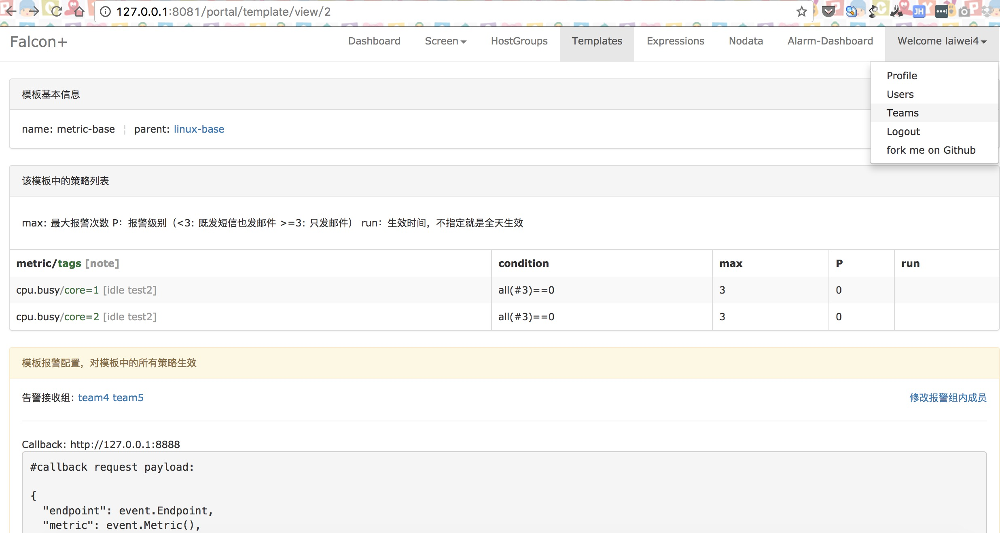
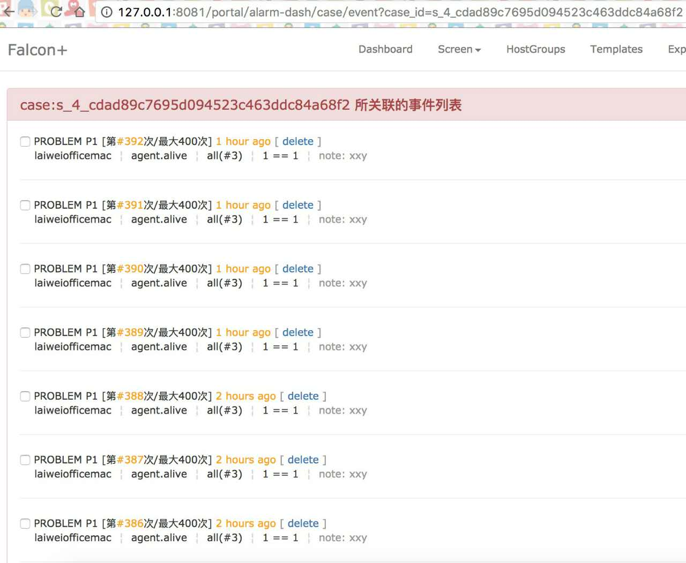

## Introduction

dashboard is the Open-Falcon unified default forntend component, including:

- user-defined dashboard and screen.
- configure managent of alerting, hostgroup, template. 
- alerting history managent and display.
- team management.
- combine the multiple alerting.
- user management, such as login, logout, register, ldap_login, etc.

Open-Falcon homepage：[http://open-falcon.com](http://open-falcon.com)

## Demo site
- [dashboard demo](http://103.73.51.204:8081/), user:`test`, password:`test123`

## i18n
Open-Falcon natively support zh_CN and currently partially support English. Any translation will be appreciated.

[How to participate in the translation](./i18n.md)


## Run in docker
```
# make the image，run commands under dir of dashboard:
docker build -t falcon-dashboard:v1.0 .

# start the container
docker run -itd --name aaa --net host \
	-e API_ADDR=http://127.0.0.1:8080/api/v1 \
	-e PORTAL_DB_HOST=127.0.0.1 \
	-e PORTAL_DB_PORT=3306 \
	-e PORTAL_DB_USER=root \
	-e PORTAL_DB_PASS=123456 \
	-e PORTAL_DB_NAME=falcon_portal \
	-e ALARM_DB_PASS=123456 \
	-e ALARM_DB_HOST=127.0.0.1 \
	-e ALARM_DB_PORT=3306 \
	-e ALARM_DB_USER=root \
	-e ALARM_DB_PASS=123456 \
	-e ALARM_DB_NAME=alarms \
	falcon-dashboard:v1.0
```

## Clone & Prepare
```
export HOME=/home/work/

mkdir -p $HOME/open-falcon/
cd $HOME/open-falcon && git clone https://github.com/open-falcon/dashboard.git
cd dashboard;

```

## Install dependency

- **CentOS**

```
yum install -y python-virtualenv
yum install -y python-devel
yum install -y openldap-devel
yum install -y mysql-devel
yum groupinstall "Development tools"


cd $HOME/open-falcon/dashboard/
virtualenv ./env

./env/bin/pip install -r pip_requirements.txt
```

- **Ubuntu**

```
apt-get install -y python-virtualenv
apt-get install -y slapd ldap-utils
apt-get install -y libmysqld-dev
apt-get install -y build-essential
apt-get install -y python-dev libldap2-dev libsasl2-dev libssl-dev

cd $HOME/open-falcon/dashboard/
virtualenv ./env

./env/bin/pip install -r pip_requirements.txt
```

## Init database
```
cd /tmp/ && git clone https://github.com/open-falcon/falcon-plus.git 
cd /tmp/falcon-plus/scripts/mysql/db_schema/
mysql -h 127.0.0.1 -u root -p < uic-db-schema.sql
mysql -h 127.0.0.1 -u root -p < portal-db-schema.sql
mysql -h 127.0.0.1 -u root -p < graph-db-schema.sql
mysql -h 127.0.0.1 -u root -p < dashboard-db-schema.sql
mysql -h 127.0.0.1 -u root -p < alarms-db-schema.sql
rm -rf /tmp/falcon-plus/
```

**if you are upgrading from v0.1 to current version v0.2.0,then**

    mysql -h 127.0.0.1 -u root -p < alarms-db-schema.sql


## Configure
    dashboard config file is 'rrd/config.py', change it if necessary.

    ## set API_ADDR to your falcon-plus api modules addr, default value as bellow:
    API_ADDR = "http://127.0.0.1:8080/api/v1" 

    ## set PORTAL_DB_* if necessary, default mysql user is root, default passwd is ""
    ## set ALARM_DB_* if necessary, default mysql user is root, default passwd is ""
    ## if following error msg occurred, please check DB config in rrd/config.py
    
    Error 'NoneType' object has no attribute 'cursor'

## Start in debug mode

    $ ./env/bin/python wsgi.py

    open http://127.0.0.1:8081 in your browser.


## Run with gunicorn in production mode

    $ bash control start

    open http://127.0.0.1:8081 in your browser.


## Stop gunicorn

    $ bash control stop

## Check log

    $ bash control tail


## Screenshots




 
## Mailing lists

- [openfalcon-users](https://groups.google.com/forum/#!forum/openfalcon-users) – for discussions around openfalcon usage and community support
- [openfalcon-developers](https://groups.google.com/forum/#!forum/openfalcon-developers) – for discussions around openfalcon development

## Issue tracker

We are using the [github issue tracker](https://github.com/open-falcon/falcon-plus/issues) for the various Open-Falcon repositories to fix bugs and features request. If you need support, please send your questions to the [openfalcon-users](https://groups.google.com/forum/#!forum/openfalcon-users) mailing list rather than filing a GitHub issue.

Please do not ask individual project members for support. Use the channels above instead, where the whole community can help you and benefit from the solutions provided. If community support is insufficient for your situation, please refer to the Commercial Support section below.

## Contributing
We welcome community contributions! Open-Falcon uses GitHub to manage reviews of pull requests.

If you have a trivial fix or improvement, go ahead and create a pull request, addressing (with `@...`) the maintainer of this repository in the description of the pull request.

If you plan to do something more involved, first discuss your ideas on our mailing list. This will avoid unnecessary work and surely give you and us a good deal of inspiration.

## Acknowledgements

Open-Falcon was initially started by Xiaomi and we would also like to acknowledge early contributions by engineers from these companies.

[Wei Lai](https://github.com/laiwei) is the founder of Open-Falcon software and community. 

The Open-Falcon logo and website were contributed by Cepave Design Team.
